# Incentive effects of changing k

## Summary: Trade-off from increasing k

Increasing $k$ can help more pools compete, but it also lowers the reward ceiling for large pools and can create a temporary oversaturation shock.

**Pros**
1. More pools can fit below saturation, which helps smaller and newer pools compete.
2. Delegators can shift toward smaller pools with stronger pledge and lower margins.
3. Some operators can retain or gain delegation by cutting margin.

**Risks**
1. Large pools lose reward capacity once they are pushed earlier into saturation.
2. A higher $k$ can trigger a short-lived oversaturation shock and temporary yield losses.
3. These two factors may prompt delegators to leave the ecosystem and encourage operators to open new pools, ultimately undermining potential stake redistribution.

**What the evidence suggests**
1. Oversaturation was temporary and mostly faded after redelegation.
2. Delegators moved toward smaller still-undersaturated pools.
3. Margin reducers tended to retain or gain stake better than pools that kept fees unchanged.
4. The network-wide APR gain was modest and partly reflected the exit of weak pools.
5. The observations are descriptive, not causal, because new low-stake pools and new stake entered in the same period.

**Behavioral and equilibrium discussion**
1. Increasing $k$ shifted delegation toward smaller, still-undersaturated pools, but the effect was temporary and largely faded as the system rebalanced.
2. Margin cutting was the main operator response: pools that reduced fees retained or gained stake more often than pools that kept margins unchanged.
3. The redistributive effect was strongest for smaller pools near the new saturation boundary, while very large pools lost relative reward capacity.
4. The network-level APR gain was modest and partly reflected the exit of weak pools rather than a clean causal effect of the parameter change alone.
5. The system-level evidence remains suggestive, not causal, because new low-stake pools and new stake entered in the same window.

**Policy interpretation**
1. Higher $k$ supports small-pool entry and competition.
2. It likely improves decentralization in a broad sense, but the evidence is suggestive rather than causal.
3. The trade-off is between more room for small pools and weaker rewards for large ones.

## Parameter values at the current state
For the numerical analysis in this section, we use the parameter values below unless stated otherwise. These values may differ from the snapshot values reported in [Parameter-Landscape.md](../../Parameter-Landscape.md), because this comparative-statics exercise is anchored to a single reference state.

| Symbol | Parameter | Value |
| --- | --- | --- | 
| $R$ | Reward pot | $14.9M$ ADA| 
| $T$ | Total ADA supply | $38.8B$ ADA | 
| $k$ | Target number of stake pools | 500 | 
| $a_0$ | Pledge influence. | 0.3 | 
| $c_{min}$ | Minimum fixed cost (`minPoolCost`). | 170 ADA |
| $m_i$ | Operator margin/commission deducted from delegator rewards. | 5%  |
| $\rho$ | Reserve decay rate.  | 0.3%  |
| $\tau$ | Treasury share.| 20% | 

## Design

$k$ denotes the target number of economically relevant stake pools. It is not a hard cap on the number of pools that may be registered; rather, it shifts the reward function through the saturation threshold

$$
z_0 = \frac{1}{k}.
$$

The motivation is to limit the increasing-returns pattern that appears when rewards are proportional to stake. Below saturation, delegation tends to increase the reward available to the pool and to the delegators. Above saturation, additional stake no longer increases gross rewards, which weakens the advantage of very large pools. 

Choosing $k$ therefore trades off decentralization and economic viability. A higher $k$ lowers the saturation threshold ($z_0$), reducing the stake and pledge required for a pool to become competitive and making room for more economically relevant pools. However, it also lowers the maximum gross reward available to each saturated pool, which may weaken operator profitability. A lower $k$ has the opposite effect: it allows larger rewards per pool and may improve viability, but reaching saturation—and making pledge fully effective—requires more stake and substantially more pledge, favoring larger or better-capitalized operators.

## Direct mechanical effects 
In this section we consider the direct effects of changing the parameter while holding everything else equal (ceteris paribus).

The parameter change considered here is an increase in $k$, which lowers the saturation threshold and therefore changes the reward profile before any behavioral response occurs.

### Gross pool rewards
  
Let $\sigma_i$ denote the total delegation at pool $i$, $p_i$ the declared pledge of the pool, and $z_0$ the saturation threshold. The gross pool reward function is

$$f(\sigma_i,p_i) = \frac{R}{1+a_0} \left[ \tilde{\sigma}_i + a_0\tilde{p}_i \frac{\tilde{\sigma}_i-\tilde{p}_i\frac{z_0-\tilde{\sigma}_i}{z_0}}{z_0} \right], \qquad \tilde{\sigma}_i = \min\\{\sigma_i, z_0\\}, \qquad \tilde{p}_i = \min\\{p_i, z_0\\},$$

which does not depend on $c_{min}$.

> **Note:** Most of the analysis presented in this document assumes a static environment, omitting the dynamic, inter-epoch feedback effects of return flows to the reserves. While return flows can be evaluated statically for a given state, fully dynamic feedback scenarios will be explicitly indicated.

The effect of changing $k$ on $f(\sigma_i,p_i)$ depends on whether the caps  $\tilde{\sigma}_i = \min\\{\sigma_i, z_0\\},$ and $\tilde{p}_i = \min\\{p_i, z_0\\}$ are binding or not:

$$
\frac{\partial f}{\partial k} =
\begin{cases}
\displaystyle \frac{R a_0 p_i}{1+a_0} \left[\sigma_i-p_i+2kp_i\sigma_i\right]\geq 0, & k < \frac{1}{\sigma_i}, \qquad \text{equivalently $ \sigma_i < \frac{1}{k}$}\\
\displaystyle -\frac{R}{(1+a_0)k^2}\leq 0, & \frac{1}{\sigma_i} < k \leq \frac{1}{p_i}, \qquad \text{equivalently $ p_i \leq \frac{1}{k} < \sigma_i$}\\
\displaystyle -\frac{R}{k^2}\leq 0, & \frac{1}{p_i} \leq k, \qquad  \text{equivalently $   \frac{1}{k}\leq p_i $}.
\end{cases}
$$

Thus, increasing $k$ elevates $f_i$ for pools below saturation, but reduces $f_i$ once the pool becomes constrained by the lower saturation limit. The plot below illustrates the first line of the previous equation, showing the cap's effect on gross pool rewards—specifically, how the maximum achievable reward for a pool decreases as $k$ increases

  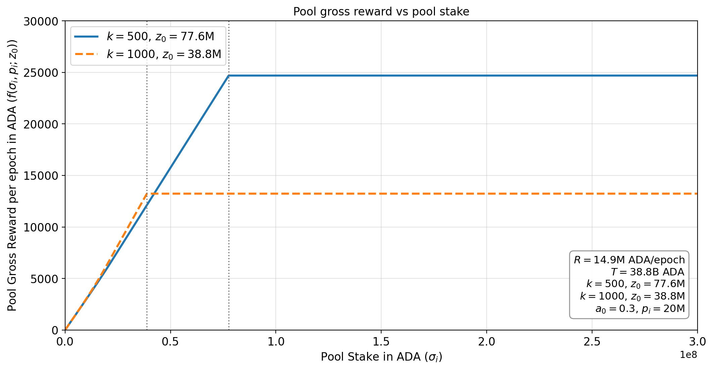

The next plot illustrates a discrete increment of $k$ from $500$ (left) to $1000$ (center), with the net difference shown on the right. Each heatmap displays the gross reward $f(\sigma_i, p_i)$ for a pool as a function of its delegation ($x$-axis) and pledge ($y$-axis), where darker green indicates higher rewards. Doubling $k$ halves the saturation threshold from $z_0 = 77\text{M ADA}$ to $z_0 = 38.5\text{M ADA}$ (marked by the vertical line in the center plot). Consequently, rewards for pools exceeding $38.5\text{M ADA}$ decrease—reflected in the muted green tones—because their rewards are capped earlier. The difference plot on the right highlights this shift: while larger pools experience reduced yields, medium-sized pools operating near the new $z_0$ now occupy the optimal reward band.
  

  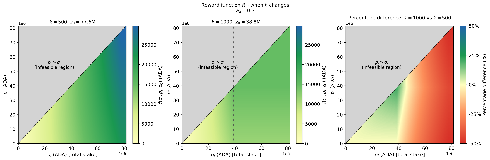

### Operator gross revenue

While gross rewards provide a baseline, a pool operator's actual earnings depend on their specific fee structure. The pool operator's gross revenue function, $\Pi_i$, is defined as:

$$\Pi_i = 
\begin{cases} c_i + \bigl(f(\sigma_i, p_i) - c_i\bigr) \left[m_i + (1 - m_i) \frac{\hat{p}_i}{\sigma_i}\right], & \text{if } f(\sigma_i, p_i) > c_i, \\ 
f(\sigma_i, p_i), & \text{otherwise} 
\end{cases}
$$

where $\hat{p}_i$ represents the operator's active pledge (the stake or delegation owned by the operator), and $c_i$ denotes the fixed pool cost (minPoolCost).

An increase in $k$ alters $f(\sigma_i, p_i)$ without directly affecting the margin $m_i$ or $c_i$. However, because this change shifts the relative weight of $f(\sigma_i, p_i)$ within $\Pi_i$, it may ultimately lead the operator to adjust $m_i$ and $c_i$—a decision dynamics studied in later sections. The next plot shows the effect of increasing $k$ in $\Pi_i$, under a fixed cost of $c_i = 170\text{ ADA}$ and a margin of $m_i = 5\%$.

  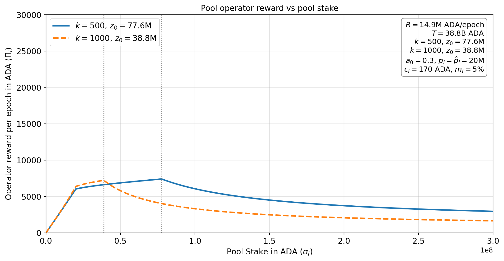

Using the same fixed cost and margin, rhe following figure plots net operator rewards for any combination of pledge and stake. As in the previous heatmap, the panels compare $k = 500$ (left) and $k = 1000$ (center) across total delegation ($x$-axis) and pledge ($y$-axis), with the rightmost panel showing the net change between the two scenarios. 

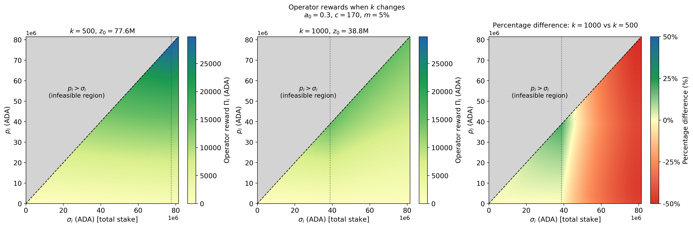

Because the protocol reimburses operators for their declared fixed costs ($c_i$), incorporating fixed-cost income mitigates the impact of increasing $k$, particularly for pools with low pledge, even if the pool becomes oversaturated. This mitigation occurs because fixed costs are deducted from the total pool rewards before they are distributed to delegators—effectively reducing the delegators' share of pool rewards, which are given by $f(\sigma_i, p_i; z_0) - c_i$. Hence, pools with lower pledge (and higher proportion of third-party delegations) redirect a larger relative portion of delegator returns toward the operator.

### Delegator return per unit of stake

Increasing $k$ affects the delegator return per unit of stake,

$$\frac{\max\\{f(\sigma_i,p_i)-c_i,0\\}}{\sigma_i},$$

through the reward function $f(\sigma_i,p_i)$, as detailed above. The following plots illustrate the shift in delegator returns per unit of stake when $k$ increases from $500$ to $1,000$. The right panel zooms in on the region around the maximums to highlight the marginal reward increase for delegators in newly near-saturated pools. In contrast, delegators in pools that become oversaturated face a reduction in returns, making redelegation to another pool advantageous.

  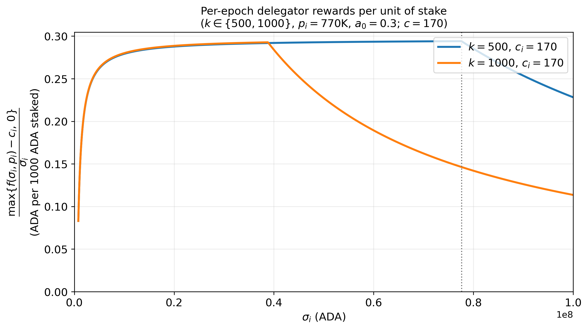
  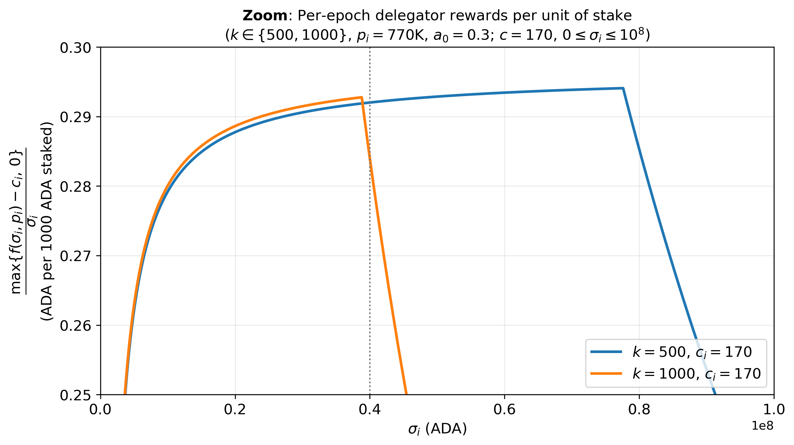

While maintaining the same delegation ($x$-axis) and pledge ($y$-axis) layout as the previous figures, this heatmap explicitly illustrates the immediate change in delegator yield per unit of stake across every combination of pledge and delegation prior to any behavioral rebalancing (such as stake migration).

Delegators remaining in now-oversaturated pools—those to the right of the vertical $z_0 = \text{38.5M ADA}$ threshold—suffer immediate yield losses. Conversely, delegators in pools operating near the new saturation boundary experience yield gains, with the most pronounced improvements concentrated in the high-pledge region along the upper area of the plot.

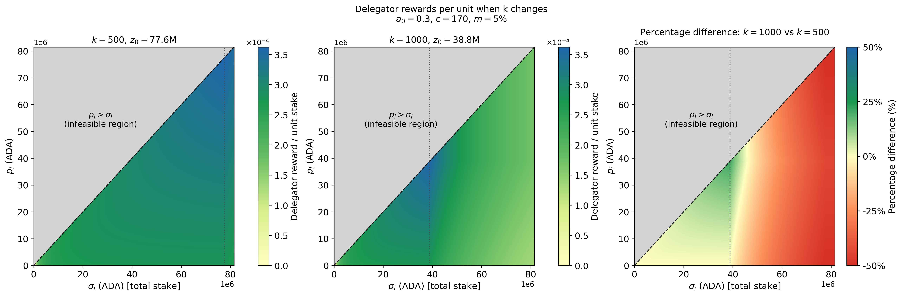

### Reward-pot and treasury flows

Raising $k$ does not have a direct mechanical effect in the total size of the reward pot or the treasury's share. It only changes how the rewards are split among pools, which may affect (due to second order effects, like changes in the staking level) how much is actually paid out.

## Past Evidence

As past evidence of a change in $k$, there is the realized historical jump ($150\rightarrow500$, i.e., $3.33\times$) around epoch $228$. This section collects data about the consequence of that change. It is important to note that the consequences and behaviors observed in that jump do not need to replicate in a new one, since market conditions and sentiments may differ. 

Key findings from this section:

1. The jump in $k$ created a short-lived oversaturation shock: many pools briefly became saturated, but redelegation soon moved stake away.
2. Delegators moved toward smaller, still-undersaturated pools, especially pools with stronger pledge and lower margins.
3. Operators that cut margins showed better stake retention and gain outcomes than pools that kept fees unchanged.
4. The distribution of stake became more balanced within the surviving cohort, but this is only suggestive evidence: it is not a causal estimate of the effect of the $k$ increase alone, and it coincides with a large influx of new low-stake pools and new stake into the ecosystem.
5. The network-wide APR gain was modest and mainly reflected the exit of weak pools and the broader market shift, not a clean, direct causal effect of the parameter change.

These are descriptive patterns rather than causal proof. Because many pools and new stake entered the ecosystem in the same window, we cannot isolate the direct effect of the increase in $k$ on the observed distributional improvement.

Next, the section reports oversaturated-pool counts and stake above saturation $E(k)$ using the same definitions introduced in **Oversaturated stake** above.

### Aggregate system snapshot
  
$$E(k) = \sum_{i : \sigma_i>0} \max\\{\sigma_i - z_0(k),0\\}.$$

| Quantity | Epoch 228 | Epoch 285 |
| :--- | ---: | ---: |
| \(T\) | 32.04B ADA | 33.03B ADA |
| \(S\) (all pools) | 17.35B ADA | 23.16B ADA |
| \(S\) (Active) | 17.31B ADA | 23.12B ADA |
| $S/T$ (all pools) | 54.2% | 70.1% |
| Active pools | 725 | 1,594 |
| — continuing to 285 | 532 | — |
| — exited by 285 | 193 | — |

where we do not consider Inactive pools, i.e., pools with zero stake, with active pledge below declared pledge, or that did not produce any block in the previous $15$ epochs (3 months)

| Quantity | Epoch 228, \(k=150\) | Epoch 228, \(k=500\) | Epoch 285, \(k=500\) |
| :--- | ---: | ---: | ---: |
| $z_0(k)$ (M ADA) | 213.58 | 64.07 | 66.06 |
| Oversaturated pools (count) | 0 | 109 | 4 |
| Oversaturated pools (% of Active) | 0.00% | 15.03% | 0.25% |
| — continuing to 285 | — | 89 | — |
| — exited by 285 | — | 20 | — |
| Unsaturated pools ($\sigma_i\leq z_0$) | 725 | 616 | 1,590 |
| — continuing to 285 | — | 443 | — |
| — exited by 285 | — | 173 | — |
| $E(k)$ - Stake above saturation (B ADA) | 0.00 | 6.14 | 0.02 |
| $E(k)$ (% of \(S\)) | 0.00% | 35.41% | 0.09% |

Main observations:

- Before the change ($k=150$), oversaturation was effectively zero.
- The historical $3.33\times$ jump to $k=500$ moved the system to $109$ oversaturated pools and $E(k)=6.14$B ADA ($35.71\%$ of $S$).
- After enough epochs, the redelegation moved away from oversaturated pools, leaving oversaturated pools again near zero.
- The snapshot also shows a important increment in the staking level $S$, the ratio $S/T$, and number of pools. However, this does not imply that the change in $k$ triggered that increment.

### Operators and delegators responses

*Delegators*

Following the increase in $k$, delegators in newly oversaturated pools migrated to those that remained undersaturated. While some delegators left the ecosystem, overall staking participation increased, indicating that departing delegators were offset by new entrants. 

The next two plots illustrate how many pools—restricted to the set of active pools present at epoch 228 and that remained unsaturated after the increment in $k$—gained or lost delegation, along with the magnitude of those shifts. The dynamics show that small pools ($0\text{--}5\text{M ADA}$) experienced the largest total staking gains, and also the highest exit rates ($287$ pools). Because total staking grew, these aggregate plots cannot isolate new incoming stake from redistributed existing stake (to disentangle whether a pool gained capital from redelegations or new entrants, individual redelegation trajectories must be tracked, data that we do not have in the snapshots).

  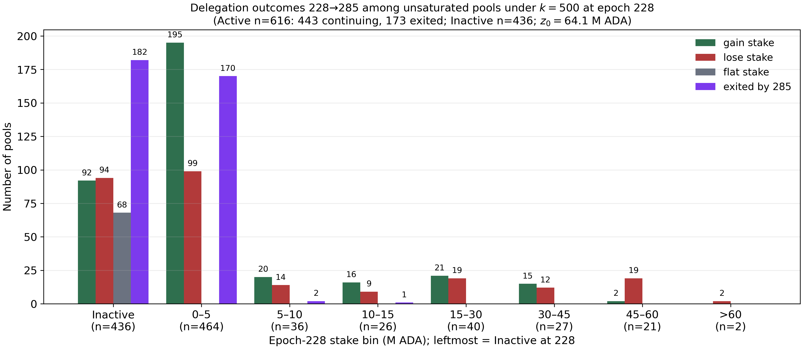
  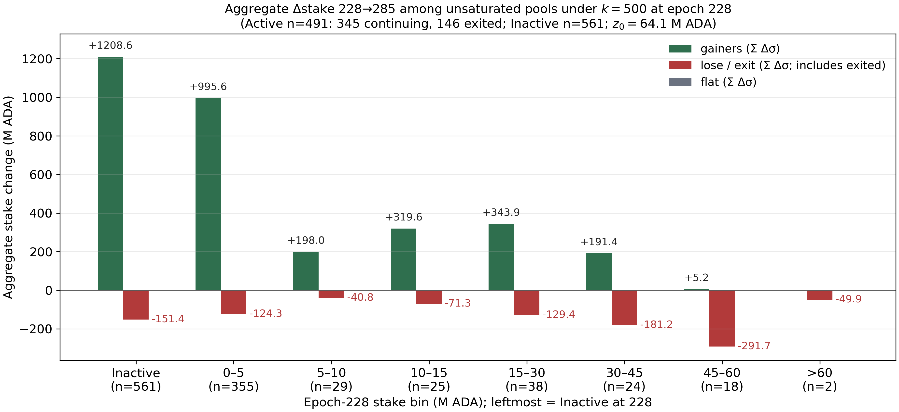

The following plots illustrate the characteristics of that set of pools grouped by their post-adjustment outcome (gain, lose, flat, or exit by epoch 285). The top set of panels covers all $1,052$ pools that were undersaturated under the new $k=500$, while the bottom set focuses strictly on the subset of $900$ small pools holding $0\text{--}5\text{M ADA}$ of initial stake. 

The data reveals that operator pledge served as the primary differentiator for stake attraction, with gaining pools maintaining a substantially higher median declared pledge ($30\text{k ADA}$) than those that lost stake ($10\text{k ADA}$), went flat ($0.2\text{k ADA}$), or exited ($3.6\text{--}5\text{k ADA}$). Additionally, gaining pools operated with slightly lower median profit margins ($1.8\%$) compared to losing or flat pools ($2.0\%$), suggesting delegators favored lower-cost fee structures paired with higher declared pledge. On the other hand, pools that remained flat or exited were characterized by near-zero initial pledge, and extremely low initial stake.

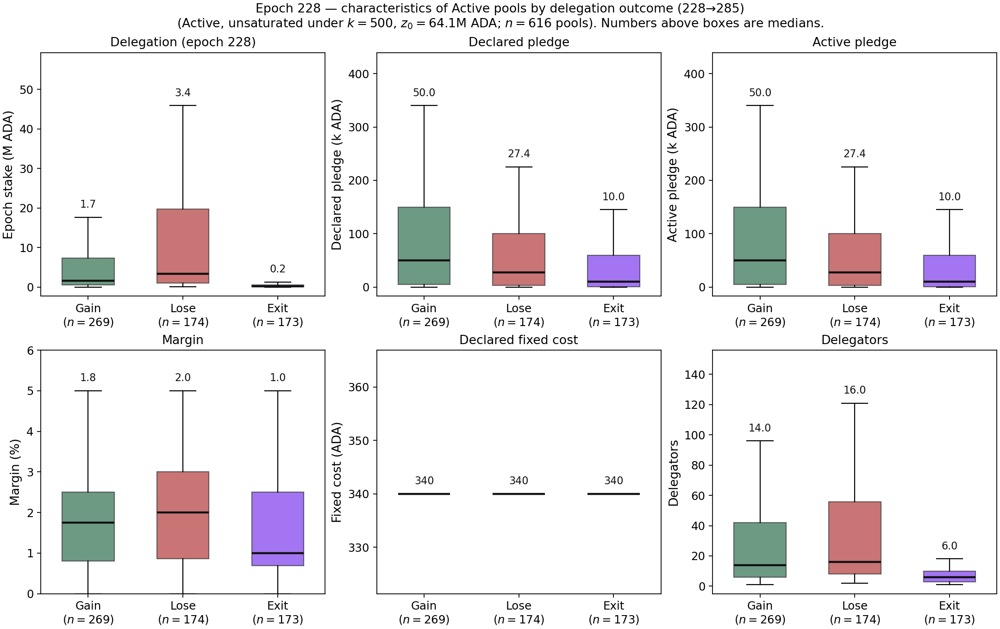

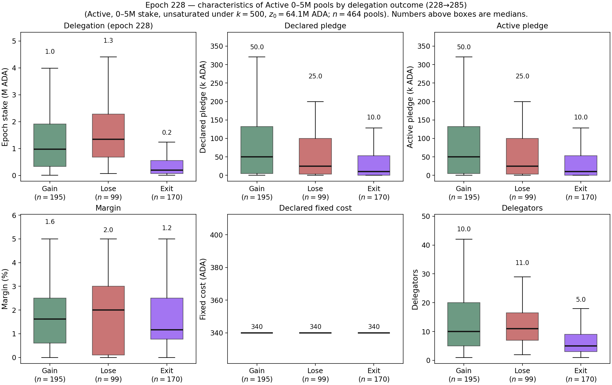

*Operators*

In the previous section, we examined the response of delegators within the cohort of pools active at epoch 228 that were undersaturated following the increase in $k$, aiming to evaluate whether the parameter increment correlated with growth among smaller pools. Note that these observations reflect empirical correlations rather than direct causality.

We also want to see the reaction of the operators. The next plot tracks margin rate changes and delegation outcomes between epochs 228 and 285 across the $851$ surviving pools (both under and oversaturated) that were active at epoch 228. The left panel details operator fee adjustments, showing that the vast majority of surviving pools ($68.0\\%$) kept their margin rate unchanged. The right panel maps these fee decisions to delegation outcomes. Operators who reduced their margin achieved the highest success rate, with $91$ pools gaining stake compared to $65$ losing stake ($58.3\\%$ gainers). Conversely, keeping margins unchanged was the least effective strategy for retaining capital, resulting in $297$ pools losing stake versus $214$ gaining stake ($51.3\\%$ losers). However, because overall market conditions changed significantly over this period—marked by a notable growth in total pools and total ecosystem stake—these parameter shifts reflect operator responses to evolving market competition rather than a direct, causal effect of the increase in $k$.

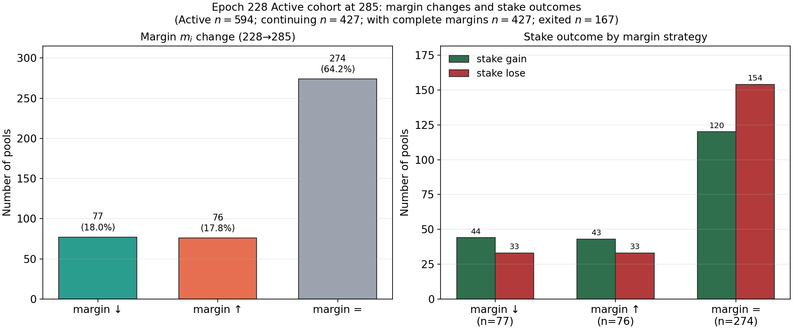

The following plots compare pools characteristics—total stake, declared pledge, and active pledge—across the $851$ surviving pools categorized by their subsequent margin fee decisions (reducers, increasers, and no change). 

The data reveals two distinct strategic profiles among operators. First, total stake strongly influenced fee changes: margin reducers ($n=156$) had smaller stake sizes, whereas margin increasers ($n=116$) were substantially larger, reaching upper quartiles above $17\text{M ADA}$. Second, pledge played a key role in fee cuts: pools that reduced margins held a median declared and active pledge of $41\text{k ADA}$—roughly double the $20\text{k ADA}$ median pledge of pools that increased or kept margins constant. This indicates that while larger pools leveraged existing stake to raise fees, it was smaller, higher-pledge operators that aggressively lowered margins to compete for incoming delegators.

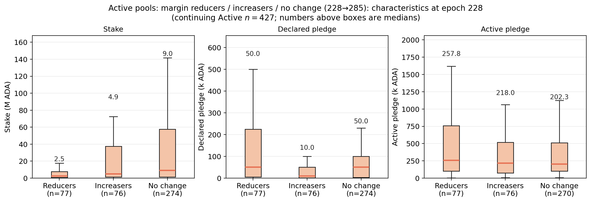

The following plot illustrates that operator adjustments to declared fixed costs were minimal, primarily because $91\%$ of the surviving cohort ($775$ out of $851$ pools) were already operating at the mandatory minimum threshold (minPoolCost = $340\text{ ADA}$). The left panel tracks pools that modified their margin fee (regardless of changes to other parameters), the center panel displays pools that adjusted their fixed costs (regardless of other changes), and the right panel isolates pools that changed strictly a single parameter—either margin or fixed cost—in either direction.

  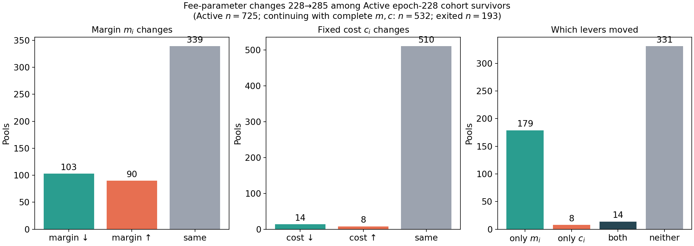

### Decentralization metrics

The following table compares decentralization metrics for epoch 228 and epoch 285. However, since many pools and new stake entered in the ecosystem in this window of time, the figures are not informative of how successful was the parameter change in this objective.

Nakamoto $N$: minimum number of pools (ranked by active stake) whose aggregate exceeds 50% of total active stake.

| Epoch | Nakamoto \(N\) | Snapshot pools | Aggregate stake of \(N\) | Total active stake | Share | Min-agg declared pledge | Min-agg active pledge |
|------:|---------------:|---------------:|-------------------------:|-------------------:|------:|------------------------:|----------------------:|
| 228 | 57 | 1,161 | 8.76B ADA | 17.35B ADA | 50.48% | 59.0M ADA | 101.6M ADA |
| 285 | 195 | 2,813 | 11.59B ADA | 23.16B ADA | 50.06% | 1.09B ADA | 1.23B ADA |

The next figure compares observed stake distributions before and after the \(k\) increment via CDFs .

- *Left panel (epoch-228 cohort)*. The plot addresses whether increasing $k$ led to a broader distribution of smaller pools by comparing all epoch-228 pools (dashed green) with those that survived to epoch 285 (solid green for their epoch-228 state, orange for epoch 285). Because exiting pools were almost entirely micro-operators with a median stake of around $0.07\text{M ADA}$, their departure naturally raised the baseline median stake of remaining pools from $0.33\text{M}$ to $0.78\text{M ADA}$. Subsequent redelegation and new incomers went into small and mid-sized pools. As a result, the median stake of surviving pools nearly doubled to $1.34\text{M ADA}$. This is, the system achieved a broader, more balanced distribution across epoch-228 cohort pools.
- *Right panel (full snapshots)*. This plot compares the overall stake distribution across all active pools at epoch 228 (dashed green) with the full ecosystem snapshot at epoch 285 (orange), including new entrant pools that joined after the parameter change. Over this period, the total pool count grew substantially from $1,161$ to $2,810$. Because a large influx of new, low-stake pools entered the system, the overall curve shifts upward and to the left, dropping the ecosystem-wide median stake from $0.33\text{M}$ to $0.16\text{M ADA}$. Thus, while tracking the surviving cohort alone shows capital shifting into mid-sized pools and out of saturated giants, taking the full snapshot at epoch 285 shows a simultaneous expansion in the absolute number of small, newly created pools. 

The two panels answer different questions—left: composition and stake reallocation *within* the 228 set; right: the ecosystem-wide distribution once entry is allowed.

  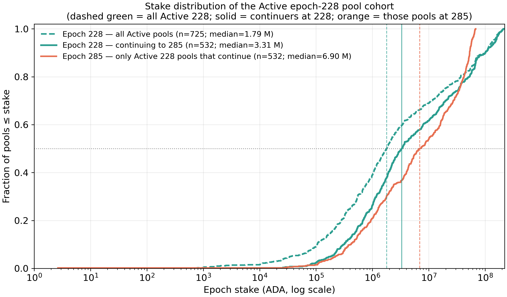
  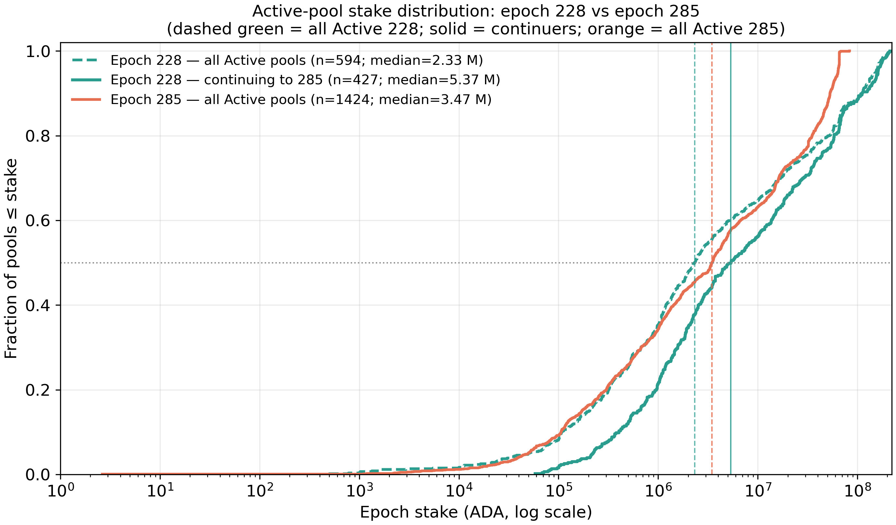

### Pools Viability

We recompute operator rewards $\Pi_i$ under $k=150$ and the counterfactual $k=500$, using the state parameters at epoch $228$: $T=32.04B$ ADA, $R = 29.7M$ ADA, $a_0=0.3$, and holding each pool’s stake, pledges, margin, and declared cost fixed. With operational expenditure (or OpEx) $C^* = 667$ per month and ADA price at $0.11$ USD (the one corresponding at epoch $228$), we get 

$$C^* = 667/6/0.11= 1010.6 \quad \text{ADA per epoch}$$. 

Let $r = \Pi_i / C^{\*}$. Among $1'077$ pools with theoretical reward ($84$ out of $1'161$ are pools where the declared pledge exceeds the epoch-228 stake), $148$ cover $C^*$ under $k=150$, of which 65 are on the edge $1\le r<2$. Under $k=500$ with the same delegation, only $134$ remain viable and the “Strong” group $r\ge 5$ falls from 32 to 10 — large pools are capped by the lower saturation point.

The plot shows a moderate impact of the increment of $3.33x$. on $k$ in the operators' viability before any redelegation or operator resonse.

| | $k=150$ | $k=500$  | Variation |
| :--- | ---: | ---: |---: |
| Pools  | $1077$ | $1077$ ||
| Cover OpEx ($r\ge 1$) | $148$ | $134$ | $-9.5\\%$ |
| Losing ($0<r<1$) | $929$ | $943$ | $1.5\\%$ |
| Edge ($1\le r<2$) | $65$ | $71$ | $9.2\\%$ |
| Comfortable ($2\le r<5$) | $51$ | $53$ | $3.9\\%$ |
| Strong ($r\ge 5$) | $32$ | $10$ | $-68.8\\%$ |

  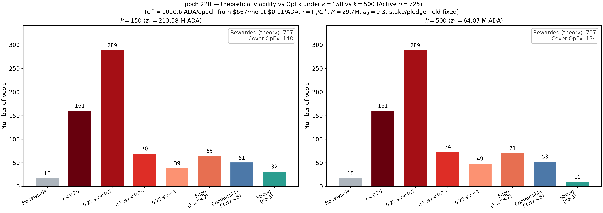

### APR

As discussed above, a change in $k$ has no immediate **direct** impact on delegator returns for pools that remain undersaturated after the parameter adjustment. However, subsequent stake migration—whether through redelegation or new entrants—alters pool sizes and ultimately changes delegator returns. Because aggregate data cannot distinguish between redistributed existing stake and brand-new incoming stake, we focus on the immediate change in APR on those subset of pools prior to any stake movement.

To evaluate how shifting $k=150 \to 500$ affects delegator returns, we calculate the annualized delegator yield

$$\mathrm{APR}_i\approx73(1-m_i)\frac{\max\\{f(\sigma_i,p_i)-c_i,0\\}}{\sigma_i}.$$
 
This measures net yield per ADA after deducting fixed costs ($c_i$) and variable margins ($m_i$). To isolate operator pricing behavior from saturation mechanics, the baseline sample is restricted to the $1'052$ undersaturated pools at epoch $228$. Of these, $762$ survived through epoch 285, while $290$ exited. For the counterfactual $k=500$ scenario, surviving pools hold their epoch 228 stake and pledge fixed while adopting their actual epoch 285 fees, allowing us to capture strategic fee responses while holding delegation constant. This captures operators’ fee responses and APR changes due to this response and due to the $k$ change without allowing subsequent delegation changes to affect the comparison (this is a simplification since fee responses could also be a consequence of new incoming pools and delegations). Exiting pools remain in the baseline $k=150$ scenario to avoid survivorship bias, but are excluded from $k=500$ as their post-exit parameters are unobserved.

| Sample and scenario | Pools | Return $>0$ | Median APR, positive | Mean APR, positive |
| --- | --- | --- | --- | --- |
| $k=150$: all undersaturated pools | 1,052 | 431 | 4.07% | 3.63% |
| $k=150$: survivors | 762 | 393 | 4.14% | 3.71% |
| $k=500$: survivors, fees adjusted | 762 | 391 | 4.15% | 3.72% |
| $k=150$: pools exiting by epoch 285 | 290 | 38 | 3.03% | 2.87% |

  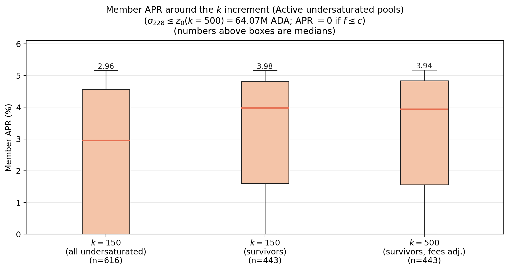

The data shows that surviving pools were inherently higher-yielding at baseline, with $51.6\\%$ ($393/762$) generating positive returns (median positive APR of $4.14\\%$), whereas only $13.1\\%$ ($38/290$) of exiting pools produced positive returns (median positive APR of $3.03\\%$). The change in $k$ may be responsible in purging underperforming operators, and  yielding a slight upward shift in both overall median positive APR (from $4.07\\%$ to $4.14\\%$) and mean positive APR (from $3.63\\%$ to $3.71\\%$) of the network. Notice that APR for surviving pools remain invariant under the counterfactual $k=500$ parameterization. This suggests that surviving operators may have adjusted their margins and fixed costs sufficiently to absorb protocol parameter changes and preserve steady yields for their delegators. That is, the increase in $k$ enhanced network-wide attractiveness by marginally lifting average delegator APR—a direct result of the exit of weak pools.

## Behavioral and equilibrium effects

This section identifies potential behavioral (or second-order) effects—primarily concerning delegator and operator decisions **given the state** at epoch 644. The following table summarizes it.

| epoch 644 | Number | Stake (B ADA) | Declared pledge (B ADA) | Active pledge (B ADA) |
|---|---:|---:|---:|---:|
| Inactive pools ($^*$) | 1,648 | 0.08 | 2.06 | 0.03 |
| Active pools| 1,262 | 21.31 | 1.96 | 5.09 |
| Total | 2,910 | 21.40 | 4.01 | 5.11 |

($^*$) We consider as inactive pools those that do not have stake, with un-met pledge (i.e., active pledge lower than declared pledge), and/or they do not produce any block in the last 3 months (15 epochs).
    
### Rational behavior

We first discuss the equilibrium effects of increasing $k$ ($500 \to 1000$) following [Brünjes et al. (2020)](../../References/papers/reward-sharing-schemes_brunjes-kiayias-et-al_2020.pdf). Doubling $k$ halves the pool saturation threshold:

$$z_0(k) = \frac{1}{k}: \qquad \frac{1}{500} \longrightarrow \frac{1}{1000}$$, 

The maximum potential gross pool reward is given by:

$$f_i(\sigma_i=z_0,p_i) = \frac{R}{1+a_0} \left[ z_0 + a_0 \min\\{p_i, z_0\\} \right].$$

The active set of pools $G_{1000}$ consists of the top $1,000$ operators ranked by their desirability $(1-m_i)(f_i(z_0,p_i)-c_i)$. The following dynamics is induced:
- Stake Reallocation: Delegators shift stake to saturate all $i \in G_{1000}$. Incumbent pools lose half their stake ($\frac{1}{500} \to \frac{1}{1000}$), freeing exactly enough aggregate stake to saturate 500 new pools.
- The staking participation is unchanged since the model assumes that there is full active stake $\sum_i ​\sigma_i​ = T$.
- Operators declared as pledge all their their available stake or cappital ($p_i = \hat{p}_i$). Hence, the declared pledge does not change.
- Operators adjust their margin $m_i$ to remain competitive. The direction of the margin changes are ambiguous as $k$ alters both gross pool rewards and the marginal competitor's profit threshold.
- Truthful reporting remains optimal.
- New pools enter in the ecosystem.

This model has several key assumptions:
- Full active stake and frictionless redelegation;
- No switching costs, search frictions, reward uncertainty, or externalities;
- Each operator manages at most one pool with stake $p_i \le \frac{1}{1000}$;
- There are sufficiently many potential operators; and
- Enough profitable candidates to support the new $k$;

Overall, the stylized equilibrium changes from $500$ pools of size $T/500$ to $1000$ pools of size $T/1000$. Delegation is redistributed, the pool-leader ranking and margins are recalculated, and net pool entry equals $500$. Pool splitting may occur, but an increase in independent operators is not guaranteed. Aggregate staking participation remains unchanged.

In reality, this benchmark is constrained by market frictions, and several empirical observations confirm that the theoretical model's underlying assumptions do not strictly hold. However, it should be noted that the predicted equilibrium describes an eventual steady state without accounting for the transition path toward it; thus, a current snapshot may simply reflect an intermediate point along that adaptation trajectory.

For instance, only a fraction of $T$ is active stake $S$. With current active stake $S \approx 21.4B$ ADA and $T \approx 38.8B$ ADA, the maximum number of simultaneously saturated pools is bounded by

$$
N_{\text{sat}}^{\max}(k)=\frac{S}{T/k}=\frac{S}{T}k\approx 0.552 k,
$$

which is about $276$ for $k=500$ and about $552$ for $k=1000$. 

    
### Delegators moving stake

After an increment in $k$, several pools will become oversaturated. Yield-sensitive delegators typically leave oversaturated pools for those with available capacity. Denote the per-pool saturation point as $z_0(k) = \frac{T}{k},$ and the saturation level as

$$s_i(k) = \frac{\sigma_i}{z_0(k)} = \frac{\sigma_i k}{T}.$$

Pool $i$ is oversaturated if $s_i(k)>1$, i.e., $\sigma_i>z_0(k)$. The aggregate stake/delegation above saturation is calculated with
  
$$E(k) = \sum_{i : \sigma_i>0} \max\\{\sigma_i - z_0(k),0\\}.$$

The tables below summarize how doubling $k$ drives oversaturation, quantifying both the affected pool count and the aggregate delegation impacted by the change.
  
| Quantity | Value |
| :--- | ---: |
| $T$  | $38.8B$ ADA |
| $S$  | $21.4B$ ADA|
| $S / T$ | 55.2% |
| Active pools | 1,262 |
| Inactive pools | 1,648 |

| Quantity | \(k=500\) | \(k=1000\) |
| :--- | ---: | ---: |
| \(z_0(k)\) (M ADA) | 77.5 | 38.8 |
| Oversaturated pools (count) | 7 | 214 |
| Oversaturated pools (% of pools) | 0.55% | 16.96% |
| \(E(k)\) - Stake above saturation (B ADA) | 0.07 | 4.81 |
| \(E(k)\) (% of \(S\)) | 0.35% | 22.58% |

Delegators in pools that become oversaturated following the increase in $k$ are expected to respond by redelegating to unsaturated pools. However, the possibility that some of this stake exits the ecosystem entirely cannot be ruled out.

  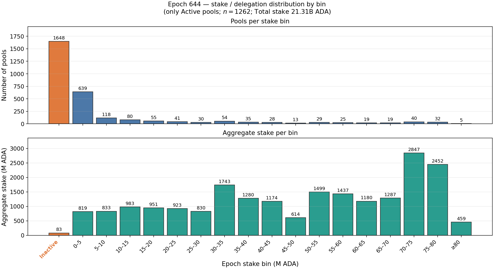

Suppose that, after an increment in $k$ from $500$ to $1,000$ (which, using epoch-644 parameters, implies $`z_0 = T/k \approx 38.8`$M ADA since $`T=38.8`$B ADA), all delegation in pools with more than $40M$ ADA redelegate to smaller pools (that is, we assume no delegation leaves the ecosystem while we use $40M$ and not $38.8M$ for simplicity). We rank pools receiving delegation using 

$$D_i=(1-m_i)\frac{\max\\{f(\sigma_i,p_i)-c_i,0\\}}{\sigma_i}.$$

If all delegators were rational and there were not market frictions, stake should be redelegated in that rank order, filling each pool up to the \(40\)M cap before moving to the next. The next plot shows this idealized result. Under this exercise, $210$ pools hold $12.95$B ADA that must move.  That stake is fully absorbed by $673$ receivers with \(D_i>0\) and about $19.73$B ADA of free capacity (this is, nothing left unredelegated). There are another $379$ pools with \(D_i=0\) and $13.99$B ADA of spare capacity, but they were not receivers. Interestingly, the $0–5$M pool count falls because some of these small pools were well-ranked receivers that started below $5$M ADA, absorb inflows and jump to $40$M ADA.

  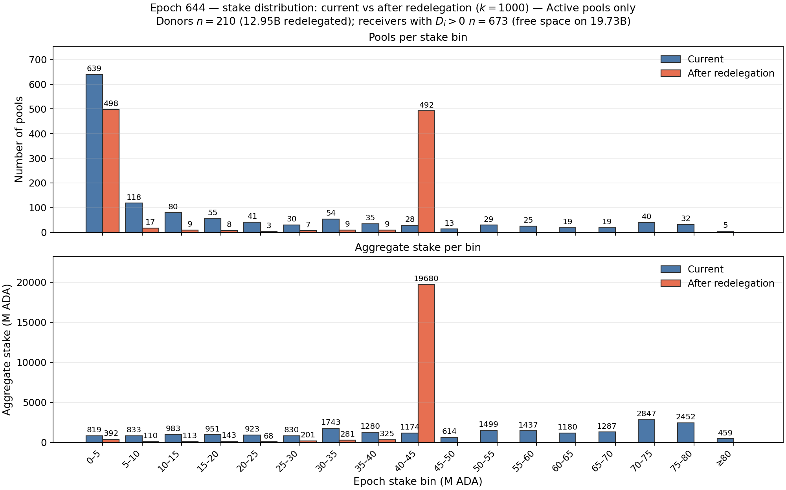

The preceding analysis relies on stylized assumptions regarding both delegator and operator behavior. In practice, delegators do not select pools based solely on the desirability metric $D_i$; they are also influenced by brand reputation, pool loyalty, and/or herding behavior, or they may decide to complete withdrawal from the ecosystem. Similarly, operators—particularly centralized exchanges or multi-pool entities—can launch new pools and actively migrate their existing stake.

  
### Pools viability.

We study here the pools viability given the current distribution of stakes, and pools snapshot. As before, we make the exercise of increasing $k$ from $500$ to $1,000$. A higher $k$ creates room for more active pools, but it also lowers the per-pool reward ceiling from about $R/500$ to $R/1000$. 

Let

$$
U_i=\Pi_i-\hat c_i,
\qquad
\Pi_i=c_i+(f(\sigma_i,p_i)-c_i)\left[m_i+(1-m_i)\frac{\hat p_i}{\sigma_i}\right],
\qquad
s_i\equiv m_i+(1-m_i)\frac{\hat p_i}{\sigma_i}\in[0,1],
$$

where $\hat c_i$ denotes the actual fixed costs.

For each pool we calculate its

$$
\Pi_i=
\begin{cases}
f_i, & f_i\le c_i,\\
c_i+(f_i-c_i)\left[m_i+(1-m_i)\dfrac{\hat{p}_i}{\sigma_i}\right], & f_i>c_i,
\end{cases}
$$

using their margin, delegation, active and declared pledge, and declared fixed cost in epoch $644$. We do not assume truthful reporting of the cost, i.e., the declared fixed cost is not the actual operating cost that the pools face. In contrast, we assume that all pools have the same operation cost/expenditure ($C^*=\hat c_i$ for all $i$) equal to $667$ USD per month or, equivalently, six epochs (for a foundational analysis of monthly operating costs, see [Lopez de Lara (2026)](https://input-output-hk.github.io/spo-incentives/pdf-viewer.html?file=references/previous-analasys/spo-incentives-analysis_lopez-de-lara_2025.pdf)), or  

$$C^*=667/6/0.15=741.1 \text{ USD per epoch},$$

where we used a price $0.15 USD/ADA$. The next plot shows the pools' viability comparison for $k=500$ and $k=1,000$ before any redelegation occurs. Groups with $r \geq 1$ reduce their pool count following an increase in $k$, whereas those with $r < 1$ increase theirs. This shift suggests migration between groups, implying a worsening of viability."

  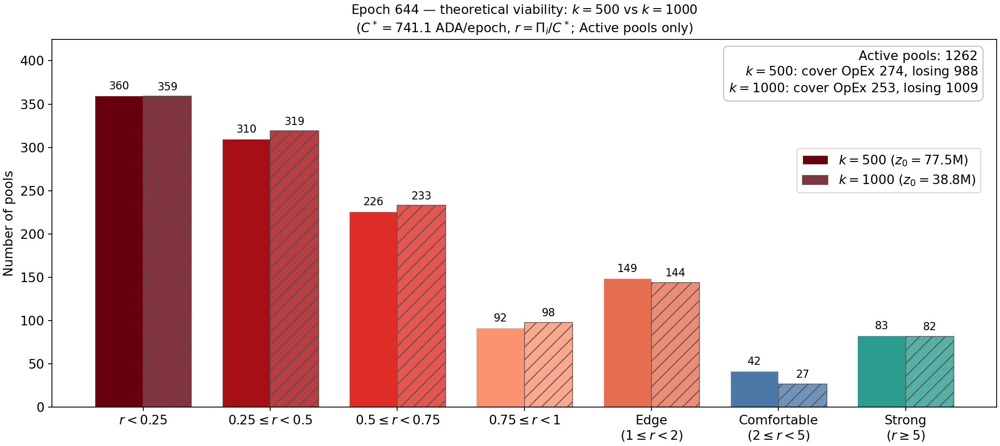

The next plot shows the characteristics of the pools in each bin/group before the change in $k$.

  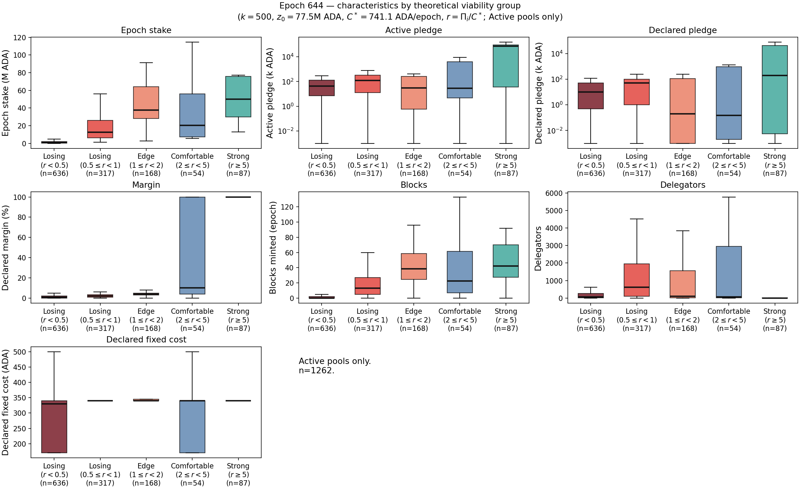

| | Losing \(r<0.5\) (n=636) | Losing \(0.5\leq r<1\) (n=317) | Edge (n=168) | Comfortable (n=54) | Strong (n=87) |
|---|---:|---:|---:|---:|---:|
| Epoch stake (M ADA), median | 0.76 | 12.60 | 37.79 | 20.30 | 50.00 |
| Active pledge (k ADA), median | 42.2 | 119.8 | 29.7 | 28.8 | 74,512.9 |
| Declared pledge (k ADA), median | 10.0 | 50.0 | 0.2 | 0.2 | 200.0 |
| Declared fixed cost (ADA), median | 330 | 340 | 340 | 340 | 340 |
| Margin (%), median | 1.0 | 2.0 | 4.0 | 10.0 | 100.0 |
| Theoretical operator reward (ADA), median | 179 | 468 | 915 | 1,840 | 10,730 |
| Coverage ratio \(r\), median | 0.241 | 0.632 | 1.234 | 2.483 | 14.478 |

Following the increase in $k$, several pool groups experienced subtle compositional shifts. The analysis below examines the baseline characteristics of pools entering these distinct tiers—noting that pools departing one group necessarily appear as entrants in another. New entrants to the Losing group ($r < 0.5$) do not exhibit low levels of staking or pledge, but instead feature very low margins and declared costs. Those entering the $0.5 \leq r < 1$ group hold a better stake position, accompanied by slightly higher margins and double the fixed cost. Pools leaving the Edge group share similar characteristics to the latter, suggesting they primarily transition into that tier. Conversely, pools leaving the Comfortable group are characterized by low pledge levels and low declared fixed costs, whereas those leaving the Strong group appear driven by a combination of moderate margins and moderate declared fixed costs.

  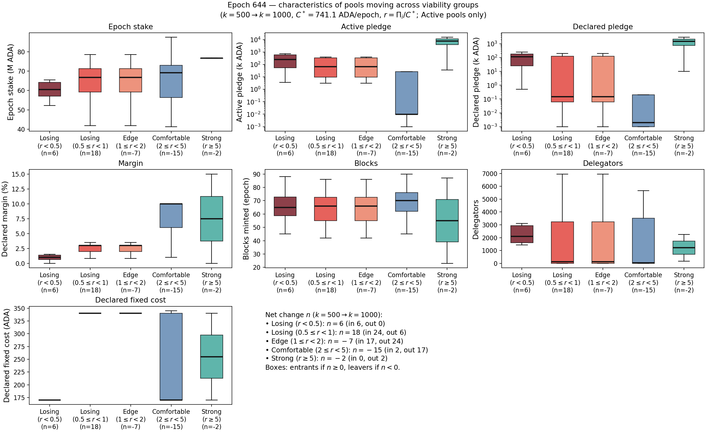

### Pool splitting incentives

An operator may divide an existing pool into two or more pools, but doing so dilutes the pledge benefit. To illustrate this, consider the initial gross reward

$$f(\sigma_i,p_i) = \frac{R}{1+a_0} \left[ \sigma_i+ a_0 p_i \frac{ \sigma_i-p_i\frac{z_0-\sigma_i}{z_0}}{z_0}\right],$$

where we assume $0<p_i\leq\sigma_i\leq z_0$, and abstract from differences in pool performance. Suppose the operator splits the pool into two identical pools, each with $\sigma_i'=\sigma_i/2$ and $p_i'=p_i/2$. The gross reward of each new pool is then

$$f'(\sigma_i,p_i) = f\left(\frac{\sigma_i}{2},\frac{p_i}{2}\right) = \frac{R}{1+a_0} \left[ \frac{\sigma_i}{2} + a_0\frac{p_i}{2} \frac{\frac{\sigma_i}{2} - \frac{p_i}{2} \frac{z_0-\frac{\sigma_i}{2}}{z_0}}{z_0}\right].$$

Consequently,

$$f(\sigma_i,p_i)-2f'(\sigma_i,p_i)=\frac{Ra_0p_i}{(1+a_0)z_0}\left[\frac{\sigma_i-p_i}{2}+\frac{3p_i\sigma_i}{4z_0}\right]>0.$$

Thus, splitting an unsaturated pool reduces aggregate gross rewards, even when all stake is retained. If $p_i=0$ or $a_0=0$, the difference is zero.

The operator's revenue, however, also depends on how pool rewards are distributed. Assume that the operator's own stake equals the declared pledge, $p_i=\hat p_i$, and that each new pool retains the original margin $m_i$ and declared fixed cost $c_i$. Provided that each new pool earns at least $c_i$, the operator receives

$$c_i+\bigl(f(\sigma_i,p_i)-c_i\bigr)\left[m_i+(1-m_i)\frac{p_i}{\sigma_i}\right]$$

before splitting, and

$$2c_i+2\bigl(f'(\sigma_i,p_i)-c_i\bigr)\left[m_i+(1-m_i)\frac{p_i}{\sigma_i}\right]$$

after splitting. The ratio $p_i/\sigma_i$ is unchanged because pledge and total stake are divided proportionally. Comparing these expressions, splitting increases the operator's revenue if and only if

$$(1-m_i)\left(1-\frac{p_i}{\sigma_i}\right)c_i>\left[m_i+(1-m_i)\frac{p_i}{\sigma_i}\right]\bigl[f(\sigma_i,p_i)-2f'(\sigma_i,p_i)\bigr].$$

The left-hand side captures the additional revenue from collecting a second fixed fee, while the right-hand side captures the operator's share of the lost gross rewards. The additional fee reallocates rewards toward the operator; it does not generate additional pool rewards. Whether splitting increases profit also depends on additional operating expenses and the operator's ability to retain and redistribute delegation. If a pool earns less than its declared fixed cost, the operator receives only the available rewards, so the revenue expressions above must be adjusted.

Holding stake, pledge, and other parameters fixed, the gross reward loss from splitting increases with $k$ while the original pool remains unsaturated, strengthening the incentive to keep stake together. To see this, note that

$$f(\sigma_i,p_i)-2f'(\sigma_i,p_i)=\frac{Ra_0p_i}{1+a_0}\left[\frac{k(\sigma_i-p_i)}{2}+\frac{3p_i\sigma_i k^2}{4}\right],$$

while 

$$\frac{\partial}{\partial k}\left[f(\sigma_i,p_i)-2f'(\sigma_i,p_i)\right]=\frac{Ra_0p_i}{1+a_0}\left[\frac{\sigma_i-p_i}{2}+\frac{3p_i\sigma_i k}{2}
\right]>0.$$

This calculation applies while the original pool remains unsaturated, meaning $k\sigma_i<1$.

We illustrate the previous discussion using an exercise. We compare how the incentive to split is affected by an increment on $k$, by considering the cohort of pools at epoch 644 that do not become overdsaturated after the increment in $k$ to $1000$. For each pool we compute

$$
\Pi_i = c_i + (f_i-c_i)\bigl[m_i+(1-m_i)\hat p_i/\sigma_i\bigr]
\quad\text{if }f_i>c_i,\quad
\Pi_i=f_i\text{ otherwise},
$$

with \(f_i=f(\sigma_i,p_i)\) and \(f_i=0\) if active pledge is below declared pledge. Suppose each pool becomes two halves with

$$
\sigma'=\sigma_i/2,\quad p'=\hat p'=p_i/2,\quad
\text{same }m_i\text{ and declared }c\text{ in each half}.
$$

We compare the unsplit operator reward $\Pi_i$ with the sum of rewards after a proportional split into two identical pools, $\Pi'+\Pi'=2\Pi(\sigma',p',\hat p',c_i,m_i)$. The exercise is restricted to Active pools that remain unsaturated after the increment, $\sigma_i\leq z_0(k=1,000)$ (1,048 of 1,262 Active pools; 214 oversaturated at $k=1,000$ excluded). The table reports how many of these pools gain or lose in $\Pi$ from splitting.

Although splitting an unsaturated pool strictly reduces aggregate gross rewards, $f(\sigma_i,p_i)-2f'(\sigma_i,p_i)>0$, operator revenue $\Pi$ rises for a majority of the cohort. This is possible when the extra declared fixed fee on the second pool outweighs the operator’s share of the lost gross rewards, but the table does not identify that channel.

| | Scenario A (\(k=500\)) | Scenario B (\(k=1000\)) |
|:---|---:|---:|
| Cohort | 1,048 | 1,048 |
| \(\Pi\) increases  | 659 (62.9%) | 658 (62.8%) |
| \(\Pi\) decreases  | 364 (34.7%) | 366 (34.9%) |
| Unchanged  | 25 (2.4%) | 24 (2.3%) |
| Median \(\Delta\Pi\) | 134.49 ADA/epoch | 134.34 ADA/epoch |
| Mean \(\Delta\Pi\) | 145.56 ADA/epoch | 145.00 ADA/epoch |

If the lower threshold makes the original pool oversaturated, however, splitting can allow stake previously above the cap to contribute to rewards. The comparison must then use the capped reward formula, replacing stake and pledge by $\min(\sigma_i,z_0)$ and $\min(p_i,z_0)$ in the gross reward calculation, and applying the same caps separately to each new pool. The unsaturated-pool inequality above therefore does not establish that splitting reduces gross rewards in this case. The overall incentive depends on stake relative to the new saturation threshold, pledge, fees, operating expenses, and delegation responses. A higher $k$ may consequently encourage more pools without producing a corresponding increase in the number of independent operators.

### Changes in staking participation

Another way of understanding the effect of the change in $k$ is whether it induces a change in the staking participation. In the previous section, we identified that increasing $k$ may reduce the gross pool reward for unsaturated pools before any response. In this section, we consider an idealized redelegation scenario where delegators rank and select pools strictly based on desirability ($D_i$), once $k$ increases, and we evaluate how the resulting redelegation alters stake distributions enough to change the overall network yield—measured by the median APR as a metric of network attractiveness. The theoretical delegator APR for pool \(i\) is

$$\mathrm{APR}_i = 73\,(1-m_i)\,\frac{\max\\{f(\sigma_i,p_i)-c_i,\,0\\}}{\sigma_i}.$$

The following table reports the median theoretical delegator APR at the current snapshot and after redelegation when $k=1000$, across active pools with \(f_i>c_i\). Notice that we do not assume that operators of oversaturated pools open a new pool. All oversaturated stake migrate to existing pools. We also abstain of considering potential coordination effects among delegators

| Quantity | Current (\(k=500\)) | After redelegation (\(k=1000\)) |
|:---|---:|---:|
| Active pools | 1,262 | 1,052 |
| Donors (\(\sigma>40\)M) | 210 | 0 |
| Receivers (\(0<\sigma\le 40\)M) | 1,052 | 1,052 |
| Pools at cap \(40\)M | 28 | 492 |
| Median pool stake | 4.72M ADA | 16.88M ADA |
| **Median APR (\(f>c\)** | **1.83%** | **1.97%** |
| Pools with \(f>c\) (APR sample) | 927 | 717 |
| Nakamoto \(N\) | 159 | 267 |
| Total stake | 21.31B ADA | 21.31B ADA |

  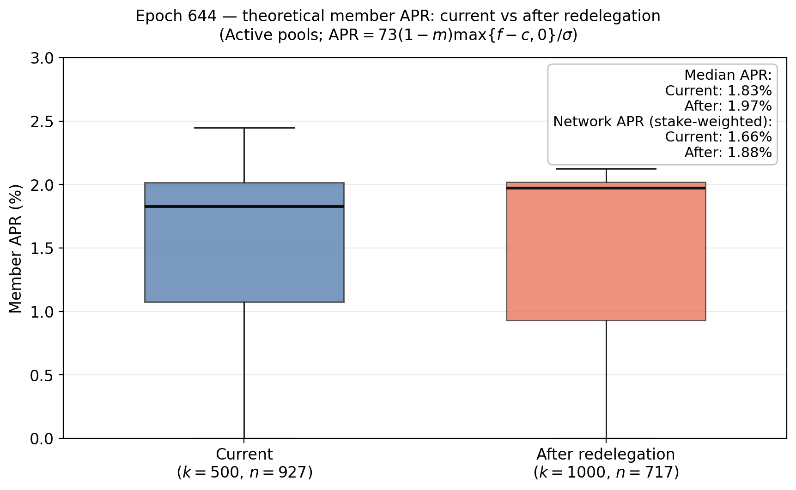

Even under a best-case redelegation scenario—where stake from newly saturated pools is optimally reallocated following the increase in $k$—the median APR rises by only an $8\\%$ relative gain. Such a marginal increase is unlikely to incentivize new capital inflow; furthermore, because this model assumes optimal delegator behavior, it represents an upper bound on potential yield improvement.

## Interaction effects

See the file analysis in the [interaction effects file](../Interaction-effects/interaction_effects.md)
